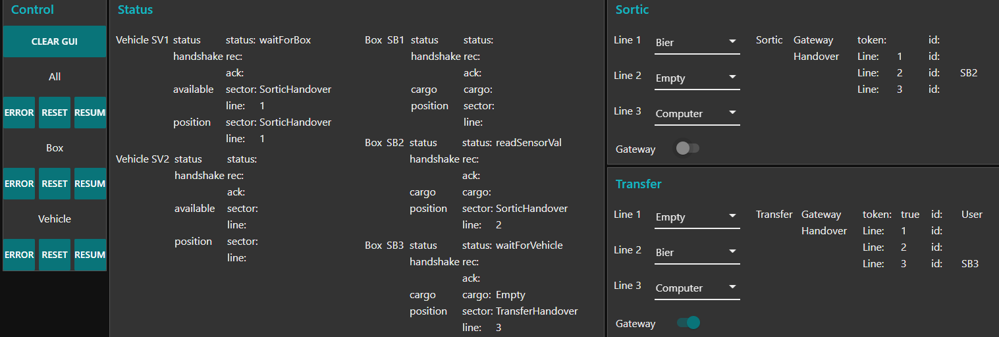
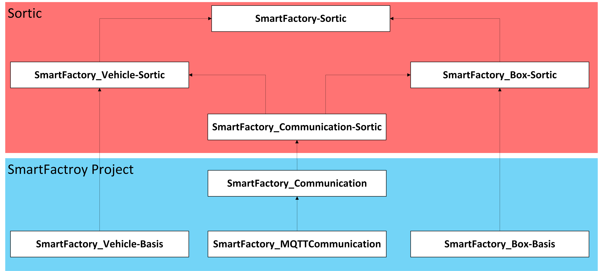

# SmartFactory-Sortic

SmartFactroy-Sortic Reposiroty provides an overview of the SmartFactroy project and its implementation into the Sortic usecase.

<!-- add Pagebreak: <div style="page-break-after: always;"></div> -->

## Table of Content

<!-- TOC Generated with https://magnetikonline.github.io/markdown-toc-generate/ -->

[TOC]


<div style="page-break-after: always;"></div>

# Usecase Sortic

At the [HSR](<https://www.hsr.ch/en>), a virtual world will be set up within the context of the [DigitalLab@HSR](<http://digitallabathsr.ch/>) in order to discuss various concepts in the field of digitization (Industry 4.0, Industry 2025) and Closed Loop Product Lifecycle Management. 

This will be illustrated by the example of two companies. 
The company Sortic manufactures automation solutions.

These are sold according to the business model "machine as a service". The customer does not buy the machine itself, but only the " sorting capacity ". The following is offered:

* 98% Ready for operation
* Defined response times
* Service for upgrades and conversion of the plant with transparent costs and times

The second company - DropKick - is a user of the Sortic system and uses it to complete its business model. The company DropKick is a delivery service startup, which is strongly digitalized. 

<p align="center">  </p>

The interaction of the two companies is the basis to explain and explore a digital ecosystem and closed-loop PLM.


[Source: SmartFactory ,Translated with [DeepL](www.DeepL.com/Translator)]

<div style="page-break-after: always;"></div>

## Sorting-system

The [functional model of the sorting-machine](https://github.com/HSRLCLab/sortic150) was developed as a "pick and place" machine based on Lego and Arduino (electrics and software).  

This is a mechatronic product with the following features:

* The machine can recognize parts and transports them to different locations depending on their property/ID.
* It is a modular product, which is distributed/produced according to an "Assemble to Order" strategy.  
* It is self-configurable: components have an RFID chip, reader and software.
 The components recognize which configuration is present and adapt themselves.  
* It is IoT capable: It has an integrated web server for communication with the Internet.

**[todo add picture of sortic, vehicle and box]**

[Source: SmartFactory ,Translated with [DeepL](www.DeepL.com/Translator)]

## Package distribution system

The Sortic plant has been extended by one new stage. It now has an autonomous package distribution system which takes over the further processing of the packages from the Sortic plant to the transfer station.

<p align="center"></p>

This happens as follows: the sorting system fills smart boxes (left side). They recognize their fill level and communicate it with smart vehicles which bring the boxes to their target location (right side). 

By using a modular approach, the package distribution system is easily scalable and very flexible.  
How this system was developed will be discussed in more detail.

<div style="page-break-after: always;"></div>

### Functional structure diagram  (FSD)

In order to identify the required functions the main function *handle package* is divided into sub-functions up to atomic functions.

<p align="center"></p>

As you can see in the functional structure the main function divides in two subfunction; *Store package* and *transport package*. 

<div style="page-break-after: always;"></div>

#### Store package

The *Store package*-function was realized as a smartbox. This box can fix the package and recognize when it is filled.  
This is evaluated with the function *Control and Communicate* and communicated to the environment.

<p align="center"></p>

While the functions *fix package* and *detect fill-level* are application independent, the control and communicate block is specific to the Sortic application and determines the communication, like handshakes, with the vehicle and the surrounding area.

The structure of the FSD can also be seen in the collaboration diagram of the source-code.

<p align="center"></p>

A possible implementation of the Box can be found in [SmartFactory_Box-Sortic](https://github.com/LMazzole/SmartFactory_Box-Sortic).  

The hardware was designed and assembled by Luciano Bettinaglio.

<div style="page-break-after: always;"></div>

#### Transport package

The *Transport package*-function was realized with a smartvehicle. The vehicle recognizes its surroundings, can follow lines, raise and lower the box and communicate with the box and its environment.

<p align="center"></p>

The main tasks of the vehicle are picking up and putting down the box and navigating on the game table while communicating with the environment. Navigation requires a drive and recognition of the surroundings. 

While the functions *detect environment* and *drive* are application independent, the control and communicate block is specific to the Sortic application and determines the communication, like handshakes, with the box and the surrounding area. The *navigation*-function is also specifically adapted to Sortic and the corresponding Gametable.

The structure of the FSD can also be seen in the collaboration diagram of the source-code.

<p align="center"></p>

A possible implementation of the Sortic dependent function can be found in [SmartFactory_Vehicle-Sortic](https://github.com/LMazzole/SmartFactory_Vehicle-Sortic) while the Sortic independent functions are in [SmartFactory_Vehicle-Basis](https://github.com/LMazzole/SmartFactory_Vehicle-Basis).

The hardware was designed and assembled by Glenn Patrick Huber and Robert Paly.

#### Communicate

The Communicate-Function which is used by *Store-* and *Transport-package* is implemented as the [SmartFactory_MQTTCommunication](https://github.com/LMazzole/SmartFactory_MQTTCommunication).  It provides basic communication functionalities and defines the message-format.

You'll need a WLAN-Connection and a MQTT-Broker. How to set this up is explained in [Setup](#setup).

<div style="page-break-after: always;"></div>

### Project structure

In order to guarantee re-usability of the code and clean interfaces, the following project structure was chosen:


<p align="center"></p>

The associated  Repositories are:  
  [SmartFactory-Sortic](https://github.com/LMazzole/SmartFactory-Sortic)  
  [SmartFactory_Box-Sortic](https://github.com/LMazzole/SmartFactory_Box-Sortic)  
  [SmartFactory_Vehicle-Sortic](https://github.com/LMazzole/SmartFactory_Vehicle-Sortic)  
  [SmartFactory_Vehicle-Basis](https://github.com/LMazzole/SmartFactory_Vehicle-Basis)  
  [SmartFactory_MQTTCommunication](https://github.com/LMazzole/SmartFactory_MQTTCommunication)  

<div style="page-break-after: always;"></div>

## Communication via MQTT

In the Sortic scenario there are four different communication partners: Sortic, SmartBox, SmartVehicle and Transfer.

The following scalable Topic-Tree is used for the communication:

<p align="center">  </p>


Each SmartBox and SmartVehicle continuously publishes its current position and its desired target position. This way, the vehicles can reserve their target position and conflicts with double occupancy are avoided.

The SmartBox and the SmartVehicle are each only registered in their currently relevant topics depending on their position and state.


### Loading and Unloading 

The sequence diagram below shows a simplified communication process of the participants for a loading process:

<p align="center">  </p>


### Sortic - SmartBox

**Sortic tells which cargo it drops on which line.**

If the SmartBox is in the right state, it listens to *Sortic/Handover*. If a Message with the same line as the SmartBox and Cargo-Information is received, the SmartBox updates its cargo.

<p align="center">  </p>

<div style="page-break-after: always;"></div>

### SmartBox - SmartVehicle

A 4-way handshake is used for a proper connection between the SmartVehicle and SmartBox.

If a participant does not respond within a certain period of time the handshake will be aborted.

<p align="center">  </p>


### SmartVehicle - SmartVehicle

There is no direct communication between the vehicles. Communication is rather based on the absence of messages. For example:

A SmartVehicle that enters the Gateway will constantly publish to *Sortic/Gateway* or *Transfer/Gateway* and thus block it. New arriving vehicles will listen if the gateway is free. If so, they will try to block the Gateway themselves and listen for a short time to if it is the only one publishing. If so, it will enter the Gateway if not it waits a random time (somewhat based on [Aloha](<https://en.wikipedia.org/wiki/ALOHAnet#Slotted_ALOHA>)) and tries to block the Gateway again until it succeeds.

<div style="page-break-after: always;"></div>

### SmartVehicle - Transfer

**Transfer tells which load it needs on which line**.

Transfer continuously publishes which cargo it needs at which handover point. 

If the SmartVehicle is in the right state, it listens to *Transfer/Handover* and compares the received messages  with its load. At the same time it also listens to which lines are already occupied. Low line numbers are are prioritized. If the SmartVehicle finds a free line that matches its cargo, it reserves it. Then it listens for a short time to see if it is the only vehicle with this destination. If so, it drives off, if not, the process starts again.

<p align="center">  </p>

### SmartVehicle - Sortic

If the SmartVehicle is in the right state, it listens to *Sortic/Handover* it listens if there are free lines at Sortic.

Low line numbers are are prioritized due to the shorter travel distances of Sortic.

Afterwards it listens for a short time to see if it is the only vehicle with this destination. If so, it drives off, if not, the process starts again.

<div style="page-break-after: always;"></div>

### TODO's

- [ ] Use a separate topic for each line in Gateway. This minimizes the number of messages to be evaluated and allows an easy upscaling of the plant with multiple lines.
- [ ] Better balance the message-payload between SmartVehicle and SmartBox to relieve the traffic on the SmartVehicle.
- [ ] Minimize the communication overhead and optimize the run time. Retain message may be a solution.

## GUI

The communication and status of the vehicles and boxes is displayed in a GUI. 

Here the user has the possibility to control the vehicles and boxes under the tab *Control*. He can send the commands *Error, Reset* and *Resume* to the subscribers and thus influence their process.

 The tab *Status* shows the current status of the active vehicles and boxes.

Under *Sortic* and *Transfer* there is the possibility to select the cargo as well as to block the corresponding Gateway. Furthermore the current occupation of the line is shown.


<p align="center">  </p>  


[Created with help from [jufritsche](<https://github.com/jufritsche>) ]


### TODO's
- [ ] add possibility to send error, reset and resume to every box and vehicle individually
- [ ] improve the GUI so that it does not need a known vehicle or box name and thus becomes scalable.

<div style="page-break-after: always;"></div>

# The SmartFactory Project

The aim of the SmartFactory Project is to provide a number of different software modules which can be used as a basis to build a smart factory[.](<https://avatars0.githubusercontent.com/u/51330787?s=400&v=4>)  
Using this modular approach, you're able to build a flexible and scalable SmartFactory tailored for your needs. Thanks to clearly defined and documented interfaces, the modules are interchangeable. This not only simplifies  maintenance but also expandability and reusability.

These modules provides only the basic functions and can (and need to) be customized.

The SmartFactroy-Project provides an interface for a  SmartVehicle, a SmartBox and communication via MQTT.

- Vehicle - [SmartFactory_Vehicle-Basis](https://github.com/LMazzole/SmartFactory_Vehicle-Basis)  
- Communication - [SmartFactory_MQTTCommunication](https://github.com/LMazzole/SmartFactory_MQTTCommunication)
- (Box -  [SmartFactory_Box-Sortic](https://github.com/LMazzole/SmartFactory_Box-Sortic) )  

If you would like to use one of these moudles, all you need to do is adding the GitHub-Link from the Repository of your choice under *lib_deps* in your platformio.ini File and you're set. All dependencies are downloaded automatically.

## Outlook

There are still some things left to do and to optimize. The desired structure of the project is:

<p align="center"></p>

In order to achieve this, the following adjustments are necessary:

- [ ] Add an general communication class which allows you to chose a protocol.
- [ ] Add an basis class for the smart box.

<div style="page-break-after: always;"></div>

# Setup

To display the GUI you need a Node-Red-Server. The MQTT-Broker also needs a server. For this purpose a Raspberry Pi is used.

## Raspberry Pi

[Raspberry Pi 3 Model B+ with 7" Touch Screen](<https://www.digitec.ch/de/s1/product/raspberry-pi-touch-kit-armv8-entwicklungsboard-kit-9121186>) with [Raspbian](<https://www.raspberrypi.org/downloads/raspbian/>) needs some additional settings to function smoothly:

It is possible that the LCD is 180 degrees upside down. In this case it is necessary to extend the config file with the following lines:

> lcd_rotate = 2

How to edit the config is documented in the [Embedded Linux: R-Pi configuration file](<https://elinux.org/R-Pi_configuration_file>)-page.

An other problem can be that the pop-up windows are too large. In this case you can add:

>framebuffer_width=1200
>
>framebuffer_heigth=720

It's also very convenient to operate the raspberry via the Computer. [You can use ssh to do this](<https://www.raspberrypi.org/documentation/remote-access/ssh/windows.md>).

If you need more information here's an [Introduction to the Raspberry Pi](<https://randomnerdtutorials.com/getting-started-with-raspberry-pi/>).

### MQTT - Mosquitto

For the communication via MQTT to work you need a broker. Here [Eclipse Mosquitto](<https://mosquitto.org/>) is used.

To install Mosquitto on the Raspberry Pi you can use [these commands](:

```shell
pi@raspberry:~ $ sudo apt update
pi@raspberry:~ $ sudo apt install -y mosquitto mosquitto-clients
```

You’ll have to type **Y** and press **Enter** to confirm the installation. To make Mosquitto auto start on boot up enter:

```shell
pi@raspberry:~ $ sudo systemctl enable mosquitto.service
```

To test the installation send the command:

```shell
pi@raspberry:~ $ mosquitto -v
```

This returns the Mosquitto version that is currently running in your Raspberry Pi. It should be 1.4.X or above.

To use Mosquitto broker later on your projects, you’ll need your Raspberry Pi IP address. To retrieve your Raspberry Pi IP address, type the next command in your Terminal window:

```shell
pi@raspberry:~ $ hostname -I
```

[Source: [How to Install Mosquitto Broker on Raspberry Pi](<https://randomnerdtutorials.com/how-to-install-mosquitto-broker-on-raspberry-pi/>)]

### Node-RED

 To install [Node-RED](<https://nodered.org/>) on the Raspbrery Pi you need to enter the following commands:

```shell
pi@raspberry:~ $ sudo apt-get update
pi@raspberry:~ $ sudo apt-get upgrade
pi@raspberry:~ $ sudo install nodejs npn
pi@raspberry:~ $ sudo apt-get install xterm
```

If you want Node-RED to run when the Pi boots up you can use

```shell
pi@raspberry:~ $ sudo systemctl enable nodered.service
```

To start and stop Node-RED you can use

```shell
pi@raspberry:~ $ node-red-start
pi@raspberry:~ $ node-red-stop
```

Once Node-RED is [running](https://nodered.org/docs/getting-started/running), point a local browser at http://localhost:1880. You can always use a browser from another machine if you know the ip address or name of the Node-RED instance - `http://{Node-RED-machine-ip-address}:1880`

More Info on how to create a flow can be found in the [Node-RED-Documentation](<https://nodered.org/docs/getting-started/first-flow>).

[Source: [Respberry Toolkit](<https://www.npmjs.com/package/raspberry>),[Node-Red Running on Raspberry Pi](<https://nodered.org/docs/hardware/raspberrypi>)]

### Node-Red Dashboard

To install the stable version use the `Menu - Manage palette` option on the top right side on the node-red site and search for `node-red-dashboard`, or run the following command in your Node-RED user directory (typically `~/.node-red`):

```shell
pi@raspberry:~ $ npm i node-red-dashboard
```

[Source: [node-red-dashboard](<https://flows.nodered.org/node/node-red-dashboard>)]

<div style="page-break-after: always;"></div>


## VSCode PlatformIO
The used  IDE is [VSCode](https://code.visualstudio.com/) with the [PlatformIO](https://platformio.org/platformio-ide)-Extension.

## Documentation

### Doxygen
Doxygen is used for the documentation of the source-code.  
An intorduction to *Doxygen* and how to install it can be found in the [ArdFSM-Repo](https://github.com/LMazzole/ArdFSM#documentation-with-doxygen).  

### Markdown
[Typora](https://typora.io/) was used for markdown documentation. The diagrams were created with [mermaid](https://mermaidjs.github.io/) or [Visio](https://products.office.com/de-ch/visio/flowchart-software).  
To support the translation [deepL](https://www.deepl.com/translator) was used.


# Contributors

- [Luca Mazzoleni](https://github.com/LMazzole)
- Luciano Bettinaglio
- Glenn Patrick Huber
- Robert Paly

# License

MIT License