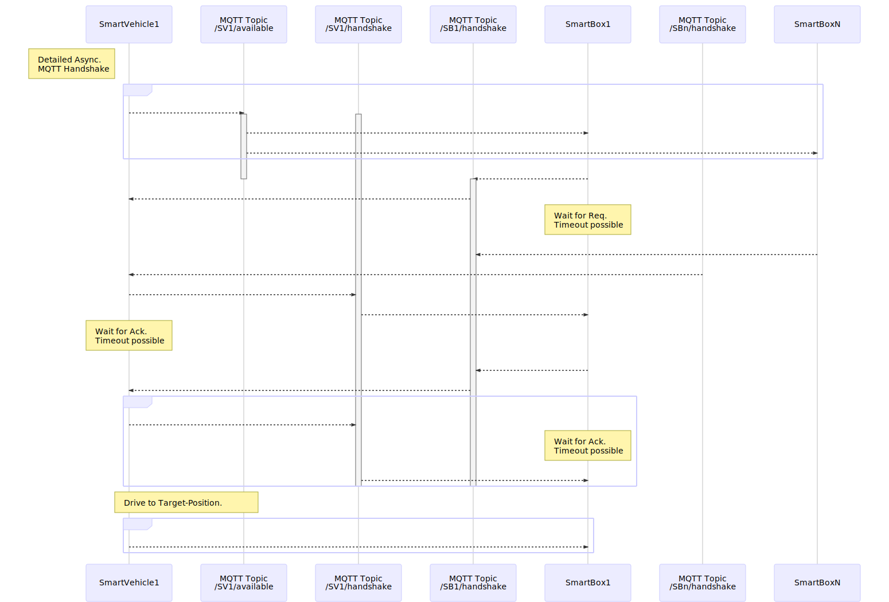
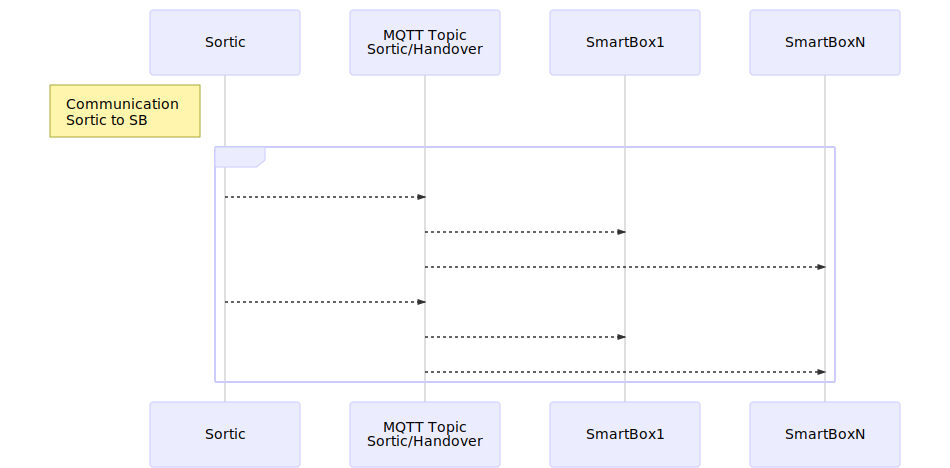

# Communication
File for Mermaide Sequence Diagramm in [Typora](https://typora.io/) or [Mermaide Live Editor](https://mermaidjs.github.io/mermaid-live-editor)


[TOC]

## Handshake
### simplified Version

Image:  


Code:  


### detailed Version
Image:  



Code:  


## Sortic

### simplified Version
Image:  


Code:  


### detailed Version
Image:  



Code:  


## Transfer
Image:  


Code:  
``` mermaid

```

### simplified Version
Image:  


Code:  
``` mermaid

```

### detailed Version
Image:  


Code:  


## load/undload process 
Image:  


Code:  

